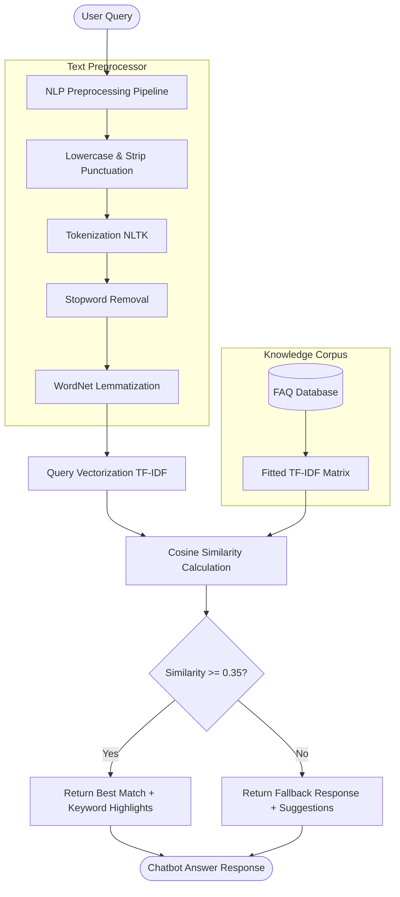

# Smart FAQ Assistant

An intelligent, production-ready SaaS FAQ Chatbot application built using **Python, Flask, NLTK, Scikit-learn, and Tailwind CSS**. It utilizes a modular Natural Language Processing (NLP) pipeline to clean text and calculates **Cosine Similarity on TF-IDF vectors** to match user questions with stored answers.


---

## Architecture Diagram



---

## Features

1. **Modern SaaS Interface**: Glassmorphism design system using Tailwind CSS, responsive layouts, animated elements, and dark/light modes.
2. **Robust Authentication**: Secure sign-up, sign-in, session cookies, and user profile updates with password hashing via `werkzeug.security`.
3. **ChatGPT-style Chat Workspace**: Auto-scroll messages, collapsible conversation histories sidebar, search filters, and session deletion/renaming.
4. **Intelligent Keyword Overlap**: Scans query keywords overlapping with the matched FAQ question and highlights matches dynamically.
5. **Fallbacks & Suggestions**: Handles out-of-domain queries below 0.35 similarity gracefully and displays alternative "Did you mean?" suggestions.
6. **Voice Recognition & Speech**: Speech-to-text dictation (microphone input) and Text-to-speech reading (speaker outputs).
7. **Conversational Exports**: Export active chat logs immediately to **TXT** or styled **PDF** documents.
8. **Admin FAQ CRUD Dashboard**: Administrative interface to add, modify, or delete FAQs, with bulk imports and exports of database records via JSON.
9. **Visual Analytics Dashboard**: Visualizes query metrics (total counts, average confidence, active users) with Chart.js charts.
10. **JSON REST API**: Fully exposed endpoint documentation.
11. **Testing Suit**: Standardized `pytest` unit test verification.

---

## Installation & Setup

### Prerequisites
- Python 3.8 to 3.11
- Virtualenv package manager

### Local Environment Setup
1. **Clone project and enter directory**:
   ```bash
   cd CODE_ALPHA_TASK2
   ```

2. **Create and activate a virtual environment**:
   ```bash
   python -o venv venv
   source venv/bin/activate
   # For Windows Power Shell: venv\Scripts\Activate.ps1
   ```

3. **Install dependencies**:
   ```bash
   pip install -r requirements.txt
   ```

4. **Set configuration flags**:
   Create a `.env` file from the example template:
   ```bash
   cp .env.example .env
   ```

5. **Run the Flask application**:
   ```bash
   python app.py
   ```
   Open your browser to `http://localhost:5001`.

---

## Running with Docker

You can build and deploy the chatbot application using Docker and Docker Compose.

1. **Build and start services**:
   ```bash
   docker-compose up --build
   ```
2. **Access the application**:
   The server is exposed on port `5001` at `http://localhost:5001`.

---

## REST API Documentation

All API requests (except login/register endpoints) require session cookie authorization.

### 1. GET `/api/faqs`
* **Description**: Retrieve a paginated list of FAQs.
* **Query Parameters**:
  - `search` (string, optional): Keyword search filter.
  - `page` (int, optional): Default `1`.
  - `per_page` (int, optional): Default `10`.
* **Response**: `200 OK`
  ```json
  {
    "faqs": [
      {
        "id": 1,
        "question": "What is Machine Learning?",
        "answer": "Machine Learning is...",
        "category": "Machine Learning"
      }
    ],
    "total": 1,
    "pages": 1,
    "current_page": 1,
    "per_page": 10
  }
  ```

### 2. POST `/api/chat`
* **Description**: Submit user message to similarity matching engine.
* **Request Body**:
  ```json
  {
    "message": "What is machine learning?",
    "session_id": "optional-uuid-string"
  }
  ```
* **Response**: `200 OK`
  ```json
  {
    "session_id": "uuid-string",
    "session_title": "What is Machine Learning?",
    "response": {
      "matched": true,
      "question": "What is Machine Learning?",
      "answer": "Machine Learning is a branch of AI...",
      "confidence": 0.95,
      "matched_keywords": ["machine", "learning"],
      "suggestions": []
    }
  }
  ```

### 3. POST `/api/faq`
* **Description**: Add a new FAQ entry (Admin only).
* **Request Body**:
  ```json
  {
    "question": "What is A/B Testing?",
    "answer": "A/B testing is a statistical hypothesis testing framework...",
    "category": "Data Science"
  }
  ```
* **Response**: `210 Created`

### 4. PUT `/api/faq/<id>`
* **Description**: Update an FAQ's question, answer, or category.
* **Response**: `200 OK`

### 5. DELETE `/api/faq/<id>`
* **Description**: Delete an FAQ entry.
* **Response**: `200 OK`

---

## Running Tests

We use `pytest` for unit and integration testing. Run:
```bash
pytest -v
```

---

## Deployment Guide

### 1. Deploying to Render
1. Create a new **Web Service** on Render pointing to your Git repository.
2. Select **Docker** environment setting.
3. Add Environment Variables:
   - `SECRET_KEY` = your-random-secret
   - `DATABASE_URL` = postgres://... (if using external PostgreSQL, or omit to default to container-managed SQLite)
4. Set the port environment variable `PORT` to `5001`.

### 2. Deploying to Railway
1. Click **New Project** -> **Deploy from GitHub repo**.
2. Under service settings, expose port `5001` or set the start command:
   ```bash
   gunicorn --bind 0.0.0.0:5001 "app:create_app()"
   ```
3. Inject the environmental variables.

### 3. VPS Deployment (Ubuntu + Nginx)
1. Clone the project to your server and configure a Gunicorn service:
   `/etc/systemd/system/smartfaq.service`
   ```ini
   [Service]
   ExecStart=/app/venv/bin/gunicorn --workers 3 --bind 127.0.0.1:5001 "app:create_app()"
   ```
2. Configure Nginx as a reverse proxy:
   `/etc/nginx/sites-available/smartfaq`
   ```nginx
   server {
       listen 80;
       server_name chatbot.yourdomain.com;
       location / {
           proxy_pass http://127.0.0.1:5001;
           proxy_set_header Host $host;
           proxy_set_header X-Real-IP $remote_addr;
       }
   }
   ```

---

## Future Extensibility
- **Vector DB Integration**: Easy drop-in replacements in `chatbot/vectorizer.py` for Milvus or Pinecone.
- **RAG Models**: Connect matched documents/passages to large language models (like Gemini API or OpenAI API) in the chat route.
- **Websockets**: Real-time websocket chat streams via Flask-SocketIO.

---


